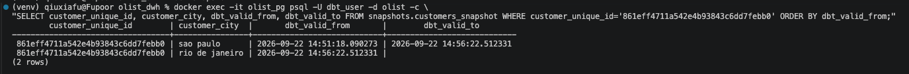

# Olist-E-Commerce-Order-Data-Warehouse

## SCD Type 2 验证

为验证客户维度的SCD Type 2实现，手动修改了一位客户在原始数据中的
所在城市（sao paulo → rio de janeiro），重新运行pipeline后，
可以看到该customer_unique_id在snapshot表中正确生成了两条历史记录：

- 旧记录（sao paulo）的`dbt_valid_to`被标记为具体的失效时间
- 新记录（rio de janeiro）的`dbt_valid_to`为NULL，代表当前生效版本

limitations
今天手动模拟的地址变更（dbt_valid_from是2026年），而Olist所有真实订单都发生在2016-2018年——理论上"正确"的SCD2事实表关联方式应该是where order_date between valid_from and valid_to（按订单发生的时间点，去匹配当时客户的历史状态），但因为我们的模拟数据时间点对不上真实订单时间，这种按日期区间关联的方式在这个demo里没有实际意义。

所以这个项目里，事实表关联维度时我们用is_current = true（只取每个客户最新状态），这是简化处理。
