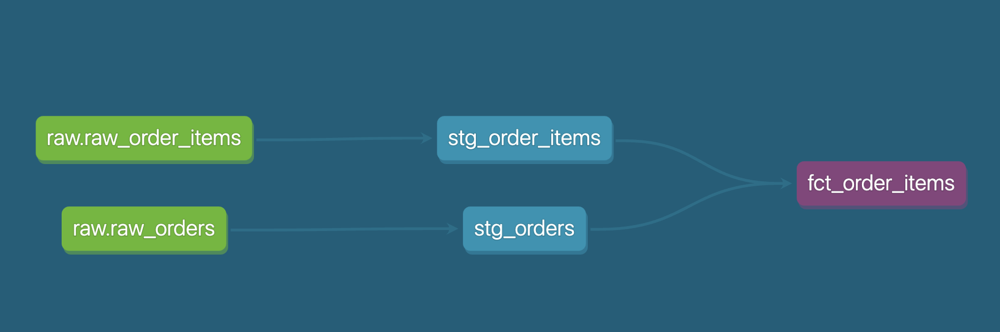

# Olist E-Commerce Order Data Warehouse

## Background

Built a dimensional data warehouse for the order subject area of Olist, a Brazilian e-commerce platform, using Kimball dimensional modeling methodology on a public dataset. Implemented a layered dbt transformation pipeline, with Slowly Changing Dimension (SCD) Type 2 tracking on the customer dimension.

## Architecture

## Tech Stack

Python, PostgreSQL, dbt, Docker, Git

## Design Notes

- **Grain**: one row per order line item (`order_id` + `order_item_id`)
- **Dimensions**: customer (with SCD2), product, seller, date
- **Bus matrix**: see `docs/design_notes.md`

### SCD Type 2 Verification

The customer dimension uses a dbt snapshot to track historical changes. To validate the implementation, a customer's city was manually updated (sao paulo → rio de janeiro), and the snapshot table correctly produced two historical records:

## Data Quality Testing

All 7 dbt tests pass, covering `not_null`, `unique`, and referential integrity (`relationships`) checks.

## How to Run

1. `docker compose up -d`
2. `python3 scripts/load_raw.py`
3. `cd olist_dwh && dbt run && dbt snapshot && dbt test`

## Challenges & Fixes

- **unique_key selection**: Initially used `customer_unique_id` as the snapshot's unique_key, but discovered it was not actually unique in the raw data (a customer placing multiple orders produces multiple rows with the same unique_id). This caused 275 records to be incorrectly flagged as changed. Fixed by adding a `stg_customers_unique` model that deduplicates using a window function.
- **Port conflict**: Port 5432 was already in use by another local project's Postgres container, so this project uses 5433 instead.
- **Python version compatibility**: Python 3.14 was too new for some dbt dependencies to install; resolved by rebuilding the virtual environment with Python 3.12.

## Limitations

The address change used to validate SCD2 was simulated manually today (`dbt_valid_from` is a 2026 timestamp), while all real orders in the Olist dataset occurred between 2016 and 2018. In a production scenario, the "correct" way to join the fact table to a historical dimension would be `where order_date between valid_from and valid_to` — matching each order to the customer's state at the time the order was placed. However, because the simulated change date doesn't fall within the real orders' timestamp range, this kind of date-range join has no meaningful effect in this demo.

For that reason, this project joins the fact table to the dimension using `is_current = true` (i.e., each customer's latest known state only), which is a simplification made specifically for this demo's constraints — not the fully correct SCD2 join pattern a production pipeline would use.
